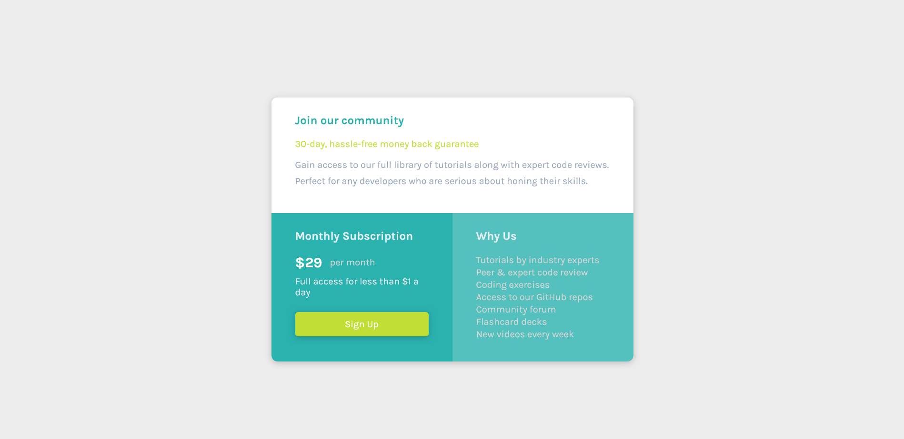

# Frontend Mentor - Single price grid component solution

This is a solution to the [Single price grid component challenge on Frontend Mentor](https://www.frontendmentor.io/challenges/single-price-grid-component-5ce41129d0ff452fec5abbbc). Frontend Mentor challenges help you improve your coding skills by building realistic projects. 

## Table of contents

- [Overview](#overview)
  - [The challenge](#the-challenge)
  - [Screenshot](#screenshot)
  - [Links](#links)
- [My process](#my-process)
  - [Built with](#built-with)
  - [What I learned](#what-i-learned)
  - [Continued development](#continued-development)
  - [Useful resources](#useful-resources)
- [Author](#author)
- [Acknowledgments](#acknowledgments)

## Overview

### The challenge

Users should be able to:

- View the optimal layout for the component depending on their device's screen size
- See a hover state on desktop for the Sign Up call-to-action

### Screenshot

### Links

- Solution URL: [https://github.com/devaramnye/single-price-gid-laptop]
- Live Site URL: [https://devaramnye.github.io/single-price-gid-laptop/]

## My process

### Built with

- Semantic HTML5 markup
- CSS custom properties
- Flexbox
- Mobile-first workflow

### What I learned

I was more aware of the semantic HTML5 markup and tryed to describe my steps in my CSS document as I want everything to be clean.

To see how you can add code snippets, see below:

### Continued development

I want to be more aware and reinforced with the HTML5 semantic and try to stay clean in HTML & CSS as I want to have a good view of my projects. My goal is to use tailwindCSS or SCSS to continue coding.

## Author

- Frontend Mentor - [@devaramnye](https://www.frontendmentor.io/profile/devaramnye)

## Acknowledgments

if someone has problems with responsivness, then I would recommend hitting up the course of Kevin Powell. It helped me alot to be more in responsivness.
